### Peer Attack 1

- Date: April 14, 2026
- Target: https://pizza.devops-cwarner.click
- Classification: Identification and Authentication Failures
- Severity: 2
- Description: I intercepted a login request to `PUT /api/auth` in Burp Suite and modified the request body by setting the password to an empty string. The frontend normally prevents empty passwords, but the backend still accepted the modified request and returned a 200 OK response with a valid JWT token. I was able to successfully log in as a valid user without providing a real password. This shows that the backend was not actually validating the password and was relying on frontend validation instead.
- Images: 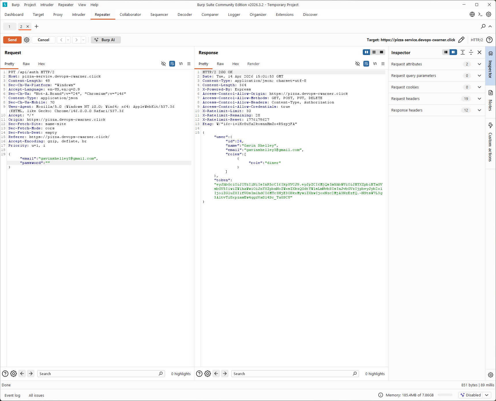
- Corrections: Add server side validation in the authentication flow to reject missing, empty, or whitespace only passwords. Ensure authentication checks are enforced on the backend before issuing a token.

### Peer Attack 2

- Date: April 14, 2026
- Target: https://pizza.devops-cwarner.click
- Classification: Broken Access Control
- Severity: 2
- Description: I intercepted a request to `GET /api/franchise/24` while authenticated as a basic user and manually changed the ID in Burp Suite. When I changed it to `GET /api/franchise/2`, the server still returned a 200 OK response. I was able to access multiple franchise endpoints (as shown by responses from both /24 and /2) even though my account should not have access to that data. This shows that the backend is not validating whether the authenticated user is authorized to access the requested franchise ID, and data can be accessed just by changing the number in the URL.
- Images: 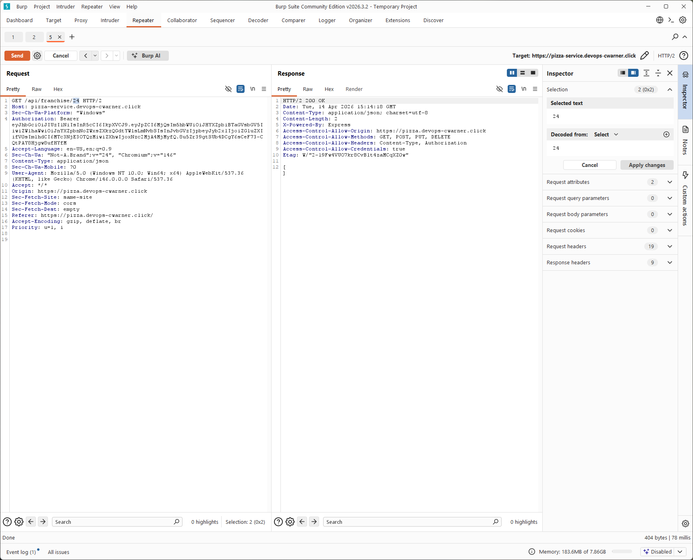 
- Corrections: Add proper authorization checks on the backend to ensure users can only access resources they are permitted to view. Validate that the requested franchise ID belongs to the authenticated user or that the user has appropriate permissions before returning any data.

### Peer Attack 3

- Date: April 14, 2026
- Target: https://pizza.devops-cwarner.click
- Classification: Insecure Design
- Severity: 2
- Description: I intercepted a `POST /api/order` request in Burp Suite and modified the item prices in the request body. I changed the prices to extreme values, including very large numbers and negative values. The server still returned a 200 OK response and created the order using those modified prices. This shows that the backend is trusting client supplied pricing instead of enforcing the actual menu prices on the server. I was able to fully control the order pricing just by editing the request body.
- Images: 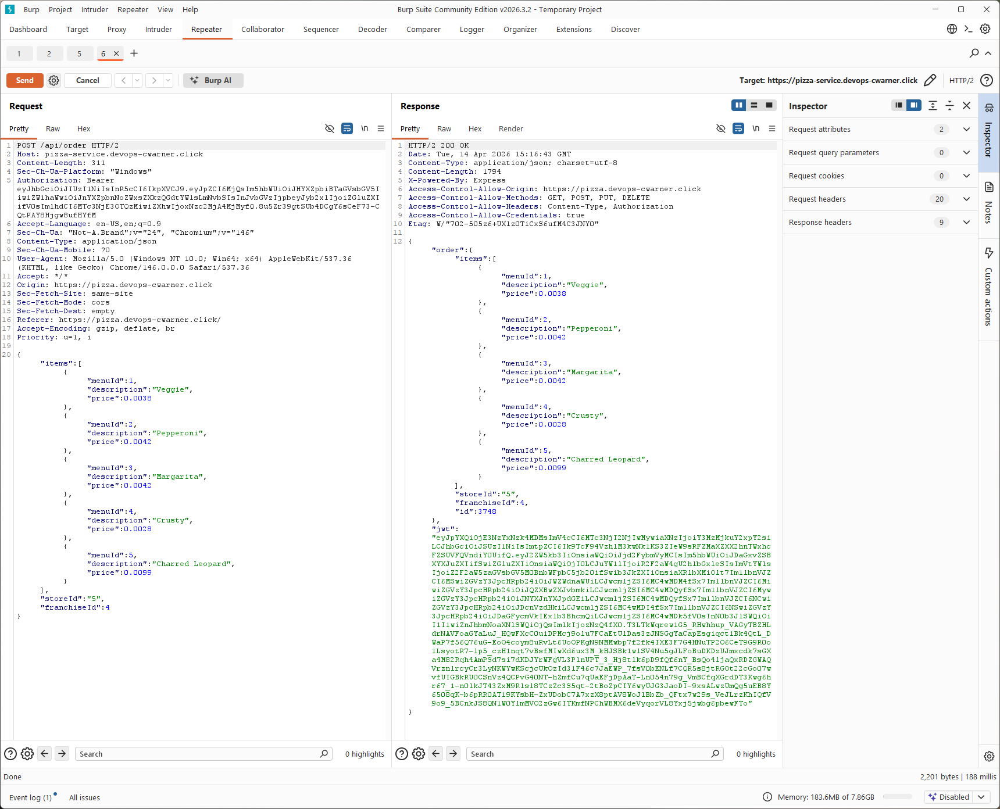 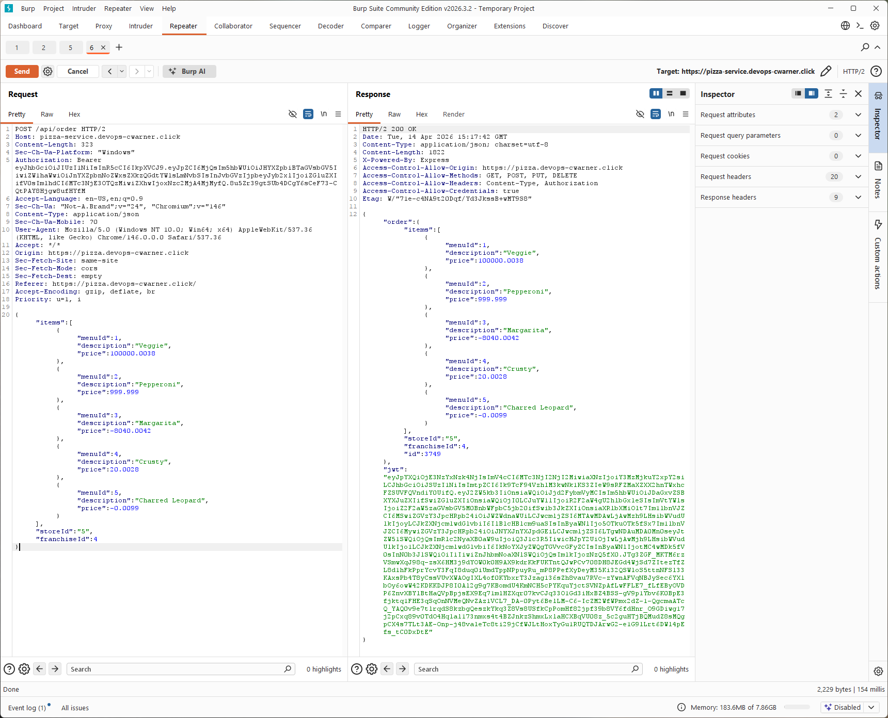
- Corrections: Enforce pricing on the backend by retrieving item prices from trusted server side menu data instead of accepting values from the client. Add strict validation to reject invalid or out of range price values.

### Peer Attack 4

- Date: April 14, 2026
- Target: https://pizza.devops-cwarner.click
- Classification: Security Misconfiguration
- Severity: 1
- Description: I accessed several common documentation and metadata endpoints directly in the browser, including `/api/docs`, `/docs`, `/version.json`, and `/robots.txt`. All of them were publicly accessible without authentication. The `/api/docs` endpoint exposed the full API structure, including routes, request formats, and example payloads. The `/docs` page provided a UI version of the same information. The `/version.json` endpoint exposed version metadata, and `/robots.txt` revealed restricted paths like `/admin-dashboard` and `/docs`. This makes it much easier to map out the application and understand how to interact with the backend without needing to reverse engineer anything.
- Images: 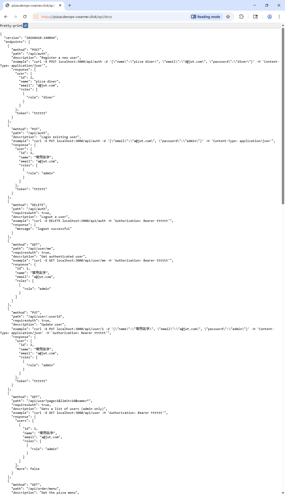 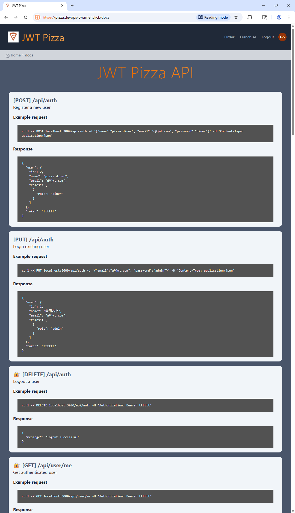 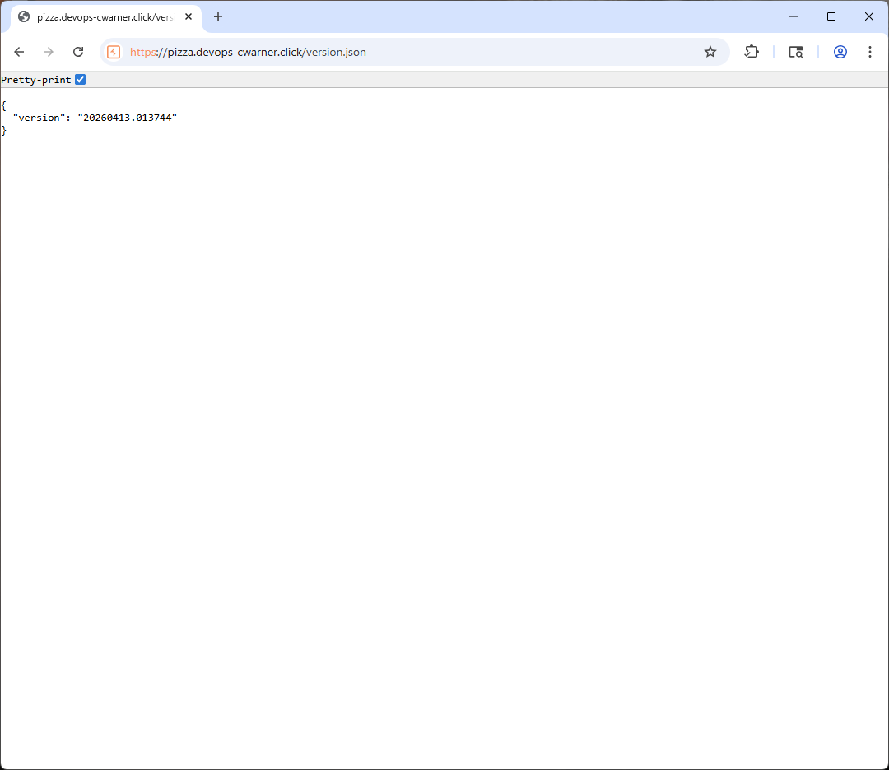 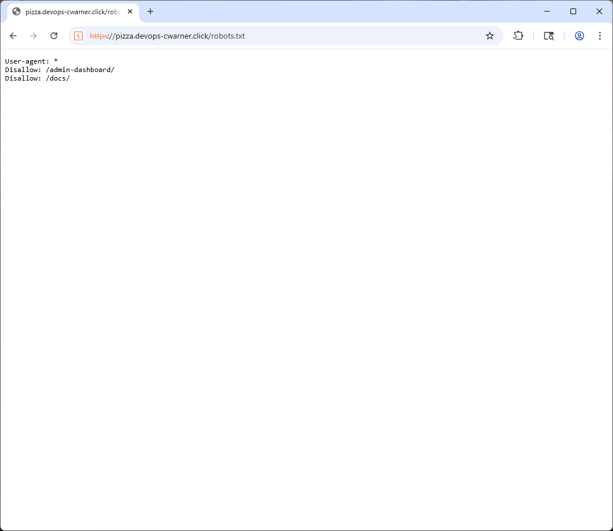
- Corrections: Disable or restrict access to documentation and metadata endpoints in production. Require authentication for sensitive routes or remove them entirely. Avoid exposing internal API structure and configuration details publicly.

### Peer Attack 5

- Date: April 14, 2026
- Target: https://pizza.devops-cwarner.click
- Classification: Broken Access Control (Tested)
- Severity: 1
- Description: Based on the exposed API documentation, I identified that the `GET /api/user` endpoint is intended to be admin only. I attempted to access this endpoint using a valid JWT from a normal diner account by sending the request through Burp Suite Repeater. The server returned a 403 unauthorized response, indicating that role-based access control was being enforced correctly. I also tested `/api/user/me`, which returned only my own user data, and attempted `/api/user/1`, which returned a 404, indicating that direct access to other users by ID is not exposed through this route. These results show that the application properly restricts access to sensitive user endpoints.
- Images: 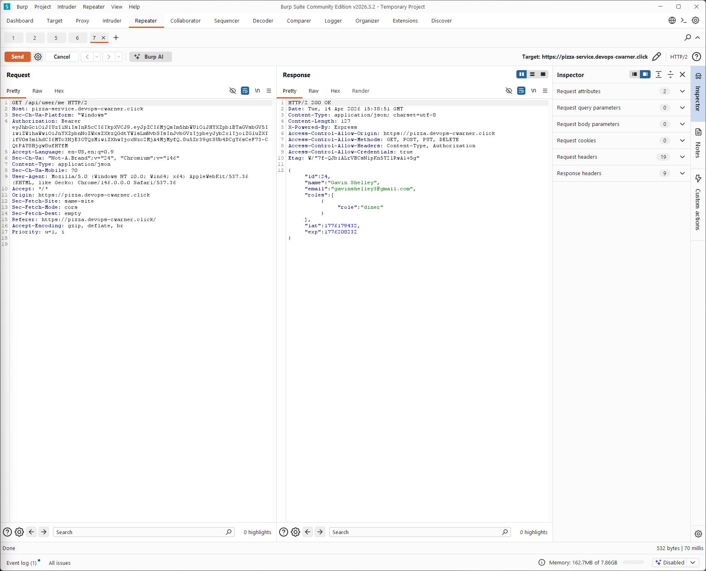 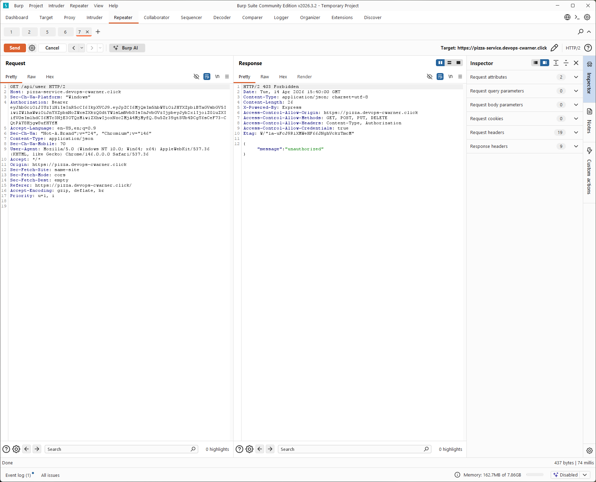 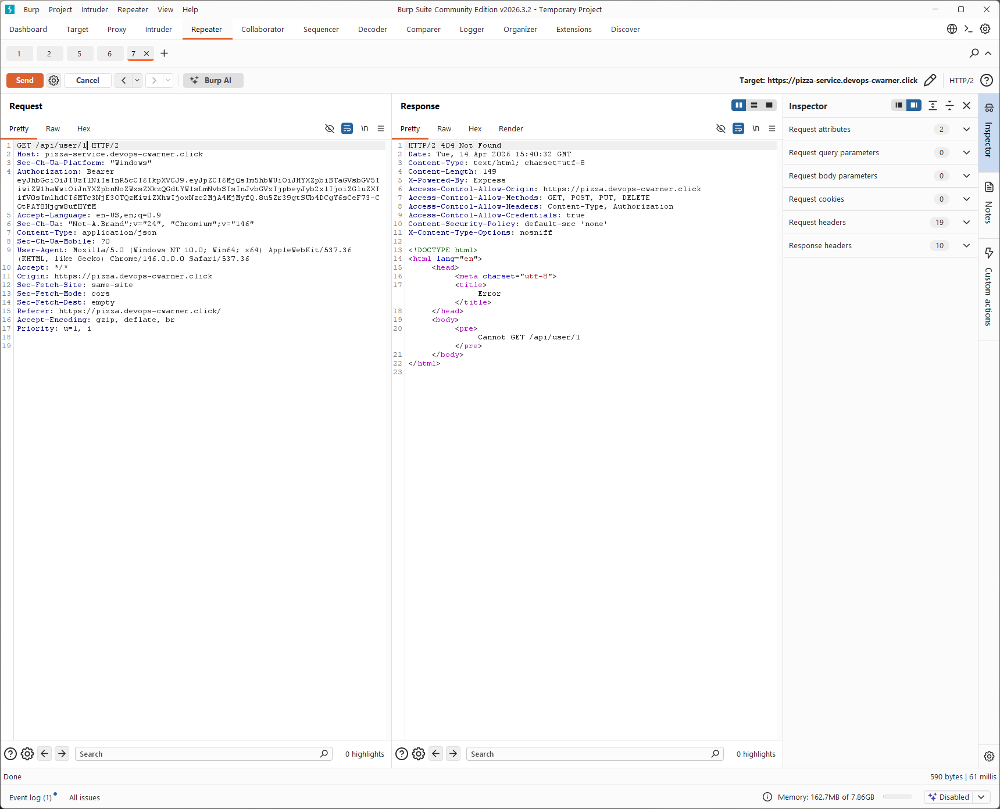
- Corrections: No changes required. The application correctly enforces authorization for admin-only endpoints.

## Combined Summary of Learnings

Working through both my own attacks and the peer attacks made it really clear how much security can break down when the backend trusts the client too much. A lot of the issues came from missing validation or authorization checks on the server, even when the frontend looked like it was doing the right thing. Things like empty passwords being accepted, being able to access other users' data by changing IDs, and modifying prices in requests all came down to the same core problem of not enforcing rules on the backend.

It also showed how small oversights, like leaving documentation endpoints public, can make it way easier for someone to understand and attack the system. At the same time, it was interesting to see cases where protections were actually implemented correctly, like the admin-only user endpoints, which helped confirm what secure behavior should look like.

Overall, the biggest takeaway for me is that you can't trust anything coming from the client. All important checks need to happen on the server, and even small gaps can turn into real vulnerabilities pretty quickly.
