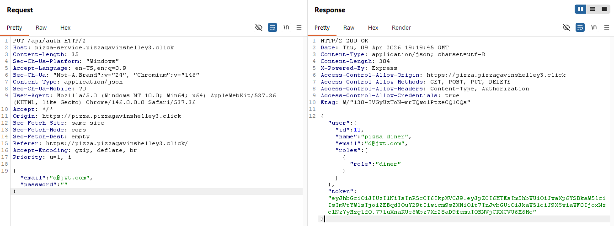
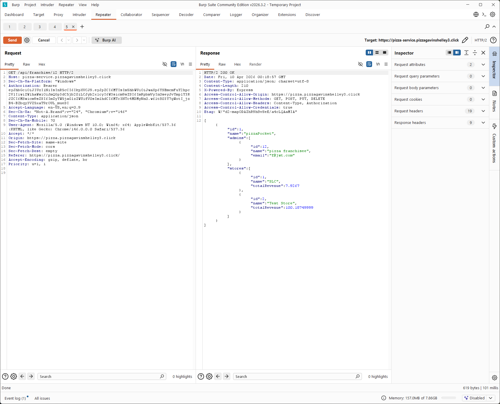
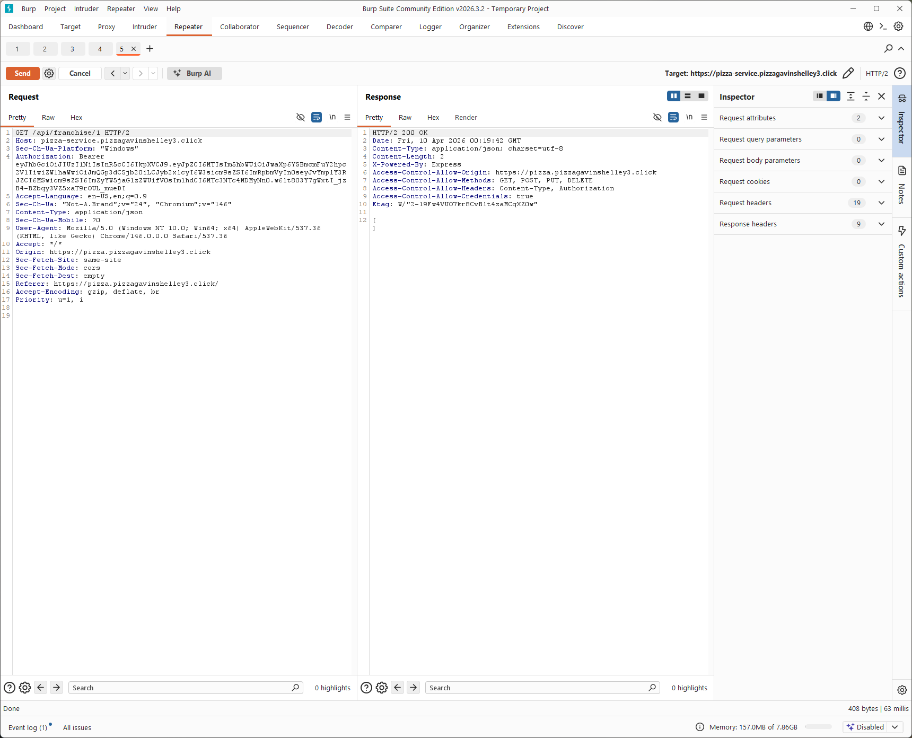
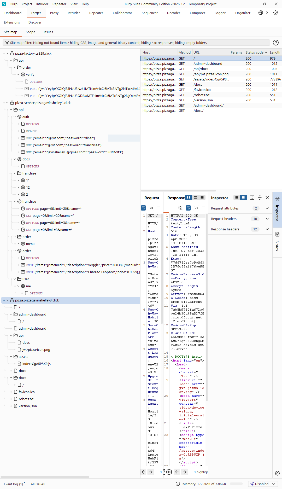
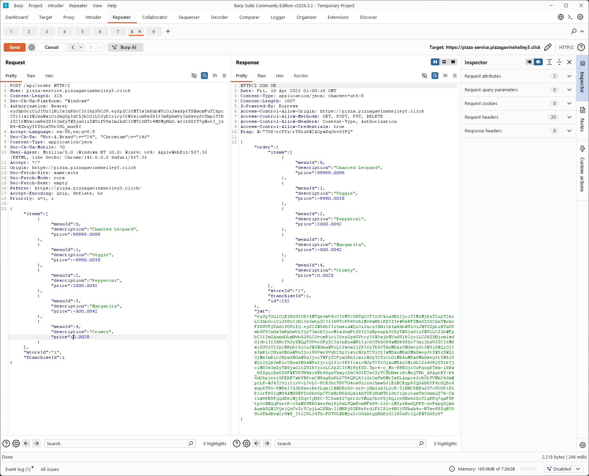
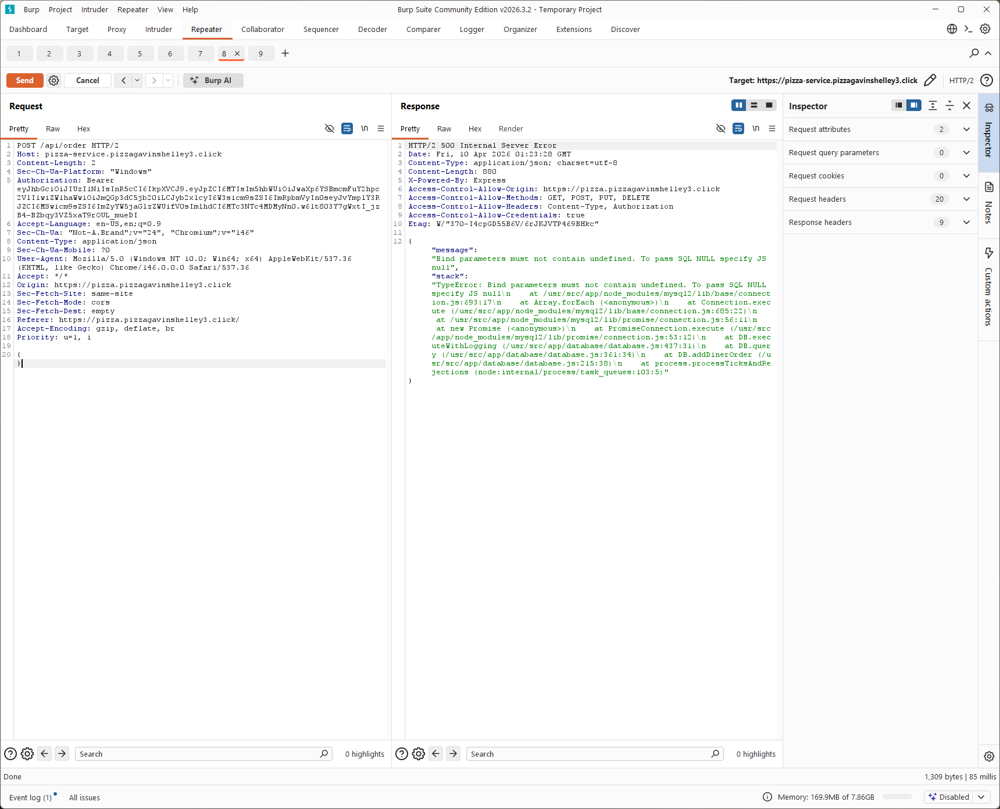
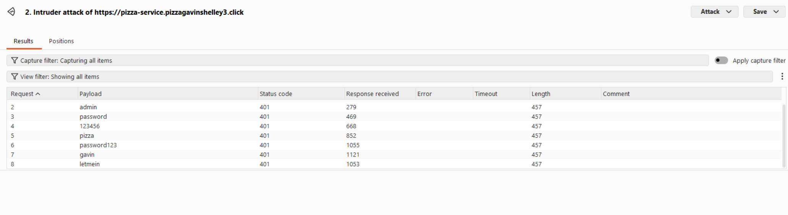
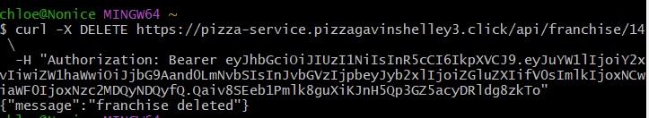
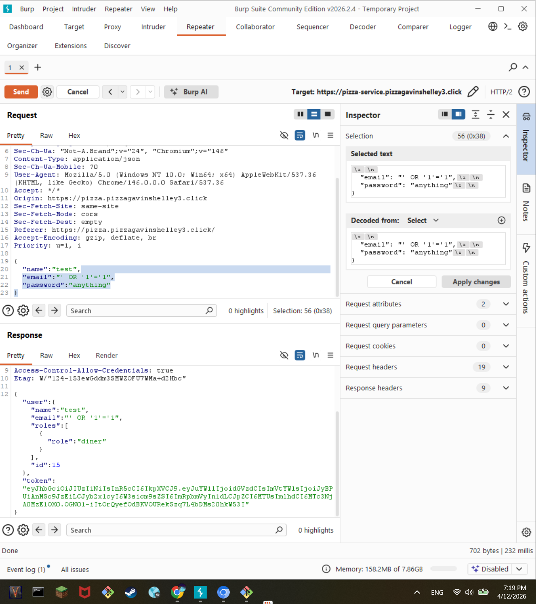

## Gavin's Self Attacks

### Self Attack 1

- Date: April 9, 2026
- Target: https://pizza.pizzagavinshelley3.click
- Classification: Identification and Authentication Failures
- Severity: 2
- Description: I intercepted the login request in Burp Suite and changed the password to an empty string. The frontend blocks empty passwords, but the backend still accepted the request and returned a 200 OK with a valid JWT token. I was able to log in as `d@jwt.com` without entering a real password. So the backend wasn't actually validating the password and was just relying on the frontend to enforce it.
- Images: 
- Corrections: I added server side validation to reject missing, empty, and whitespace only passwords before authentication runs. After the fix, I resent the same Burp request and confirmed that the server no longer returned a valid token.

### Self Attack 2

- Date: April 9, 2026
- Target: https://pizza.pizzagavinshelley3.click
- Classification: Identification and Authentication Failures
- Severity: 1
- Description: I used Burp Suite Intruder to send multiple login attempts to `PUT /api/auth` with different password guesses. All of the incorrect attempts came back with consistent 404 responses, and I wasn't able to brute force a login. At the same time, I also did not see clear rate limiting, account lockout, or increasing delays. Since I was using Burp Community Edition, the requests were throttled, so I could not fully hammer the endpoint, but from what I saw, repeated login attempts were still allowed without obvious protections.
- Images: 
- Corrections: Add rate limiting and stronger handling for repeated failed login attempts. Also add logging and monitoring for suspicious login patterns.

### Self Attack 3

- Date: April 9, 2026
- Target: https://pizza.pizzagavinshelley3.click
- Classification: Broken Access Control
- Severity: 2
- Description: I intercepted a request to `GET /api/franchise/12` in Burp Suite and changed the ID in the URL. When I changed it to `GET /api/franchise/1`, the server still returned a 200 OK and gave me data for that franchise. I was also able to access franchise 12 while authenticated as a different user. This showed that the backend was not actually checking whether I was allowed to access the franchise ID I requested. I could get other franchise data just by changing the number in the URL.
- Images:  
- Corrections: I added authorization checks on the backend so users can only access franchise data they are actually allowed to view. The endpoint now validates ownership or permissions before returning data.

### Self Attack 4

- Date: April 9, 2026
- Target: https://pizza.pizzagavinshelley3.click
- Classification: Security Misconfiguration
- Severity: 1
- Description: I tested common endpoints using Burp Suite and manual navigation, including `/api/docs`, `/docs`, `/version.json`, and `/robots.txt`. These were all publicly accessible without authentication and exposed internal app structure and metadata. I did not use them to directly exploit the app, but they made it much easier to map out the site and see what routes and resources existed.
- Images: 
- Corrections: I restricted access to internal documentation and metadata endpoints by disabling them in production or requiring authentication. After the fix, those endpoints were no longer publicly accessible.

### Self Attack 5

- Date: April 9, 2026
- Target: https://pizza.pizzagavinshelley3.click
- Classification: Insecure Design
- Severity: 2
- Description: I intercepted a `POST /api/order` request in Burp Suite and changed the request body. When I sent malformed JSON, the server returned a 400 error but also exposed a full stack trace with internal file paths and library details. I was also able to change item prices in the request, including negative prices and really large values, and the server still accepted the order with those modified prices. This showed that the backend was trusting client supplied prices instead of enforcing the real menu prices on the server.
- Images:   
- Corrections: I added stronger server side validation for order requests and made sure pricing is enforced from the server side menu data instead of from the client request. I also replaced detailed error responses with generic ones so stack traces and internal implementation details are not exposed.

## Gavin's Peer Attacks

### Peer Attack 1

- Date: April 14, 2026
- Target: https://pizza.devops-cwarner.click
- Classification: Identification and Authentication Failures
- Severity: 2
- Description: I intercepted a login request to `PUT /api/auth` in Burp Suite and modified the request body by setting the password to an empty string. The frontend normally prevents empty passwords, but the backend still accepted the modified request and returned a 200 OK response with a valid JWT token. I was able to successfully log in as a valid user without providing a real password. This shows that the backend was not actually validating the password and was relying on frontend validation instead.
- Images: 
- Corrections: Add server side validation in the authentication flow to reject missing, empty, or whitespace only passwords. Ensure authentication checks are enforced on the backend before issuing a token.

### Peer Attack 2

- Date: April 14, 2026
- Target: https://pizza.devops-cwarner.click
- Classification: Broken Access Control
- Severity: 2
- Description: I intercepted a request to `GET /api/franchise/24` while authenticated as a basic user and manually changed the ID in Burp Suite. When I changed it to `GET /api/franchise/2`, the server still returned a 200 OK response. I was able to access multiple franchise endpoints (as shown by responses from both /24 and /2) even though my account should not have access to that data. This shows that the backend is not validating whether the authenticated user is authorized to access the requested franchise ID, and data can be accessed just by changing the number in the URL.
- Images:  
- Corrections: Add proper authorization checks on the backend to ensure users can only access resources they are permitted to view. Validate that the requested franchise ID belongs to the authenticated user or that the user has appropriate permissions before returning any data.

### Peer Attack 3

- Date: April 14, 2026
- Target: https://pizza.devops-cwarner.click
- Classification: Insecure Design
- Severity: 2
- Description: I intercepted a `POST /api/order` request in Burp Suite and modified the item prices in the request body. I changed the prices to extreme values, including very large numbers and negative values. The server still returned a 200 OK response and created the order using those modified prices. This shows that the backend is trusting client supplied pricing instead of enforcing the actual menu prices on the server. I was able to fully control the order pricing just by editing the request body.
- Images:  
- Corrections: Enforce pricing on the backend by retrieving item prices from trusted server side menu data instead of accepting values from the client. Add strict validation to reject invalid or out of range price values.

### Peer Attack 4

- Date: April 14, 2026
- Target: https://pizza.devops-cwarner.click
- Classification: Security Misconfiguration
- Severity: 1
- Description: I accessed several common documentation and metadata endpoints directly in the browser, including `/api/docs`, `/docs`, `/version.json`, and `/robots.txt`. All of them were publicly accessible without authentication. The `/api/docs` endpoint exposed the full API structure, including routes, request formats, and example payloads. The `/docs` page provided a UI version of the same information. The `/version.json` endpoint exposed version metadata, and `/robots.txt` revealed restricted paths like `/admin-dashboard` and `/docs`. This makes it much easier to map out the application and understand how to interact with the backend without needing to reverse engineer anything.
- Images:    
- Corrections: Disable or restrict access to documentation and metadata endpoints in production. Require authentication for sensitive routes or remove them entirely. Avoid exposing internal API structure and configuration details publicly.

### Peer Attack 5

- Date: April 14, 2026
- Target: https://pizza.devops-cwarner.click
- Classification: Broken Access Control (Tested)
- Severity: 1
- Description: Based on the exposed API documentation, I identified that the `GET /api/user` endpoint is intended to be admin only. I attempted to access this endpoint using a valid JWT from a normal diner account by sending the request through Burp Suite Repeater. The server returned a 403 unauthorized response, indicating that role-based access control was being enforced correctly. I also tested `/api/user/me`, which returned only my own user data, and attempted `/api/user/1`, which returned a 404, indicating that direct access to other users by ID is not exposed through this route. These results show that the application properly restricts access to sensitive user endpoints.
- Images:   
- Corrections: No changes required. The application correctly enforces authorization for admin-only endpoints.

# Chloe's Personal Attacks

## Attack 1 - Brute Force Password Attack

- Date: April 8, 2026
- Target: https://pizza-service.devops-cwarner.click/api/auth
- Classification: Identification and Authentication Failures
- Severity: 2
- Description: I used Burp Suite Intruder to run a brute force attack against the login endpoint with a list of 7 common passwords. One of the attempts — using the password "admin" — came back with a 200 OK response. That turned out to be the actual admin password. There was no account lockout in place and the default credentials had never been changed, so it only took a few guesses to get in.
- Images: 
- Corrections: I set up account lockout after 3 failed login attempts to prevent brute force. I also changed the default admin password to a strong, randomly generated one.

## Attack 2 - JWT Tampering

- Date: April 8, 2026
- Target: https://pizza-service.devops-cwarner.click
- Classification: Cryptographic Failures
- Severity: 0
- Description: I grabbed a valid JWT from the browser, decoded it using Burp Suite's decoder, and changed the role field from "diner" to "admin". I then re-sent the modified token to the server. The server returned a 401 Unauthorized — it detected the invalid signature and rejected the token. The server is correctly verifying JWT signatures, so this attack did not work.
- Images: 
- Corrections: None needed. JWT signature verification is working correctly.

## Attack 3 - Token Randomness (Sequencer)

- Date: April 8, 2026
- Target: https://pizza-service.devops-cwarner.click
- Classification: Cryptographic Failures
- Severity: 0
- Description: I used Burp Suite's Sequencer tool to capture 102 JWT tokens and analyze their entropy. The analysis reported approximately 28 bits of effective randomness, which is sufficient to prevent token prediction or forgery. However, the flood of login requests generated during token collection caused a noticeable spike in my Grafana monitoring dashboard, which indicated the absence of rate limiting.
- Images:  
- Corrections: I added rate limiting using express-rate-limit with a maximum of 50 requests per 15 minutes per IP address. After the fix, I confirmed the spike no longer appeared in Grafana under the same load.

## Attack 4 - SQL Injection / Stack Trace Exposure

- Date: April 8, 2026
- Target: https://pizza-service.devops-cwarner.click/api/auth
- Classification: Security Misconfiguration
- Severity: 1
- Description: I submitted a classic SQL injection string (' OR '1'='1) in the email field of the login endpoint. The injection itself did not work — the application uses parameterized queries, so the input was treated as a literal string. However, the server's error response included a full stack trace with internal file paths and line numbers, which would give an attacker useful information about the application's internals even when the primary attack fails.
- Images: 
- Corrections: I updated the error handler to strip stack traces from production responses. Stack traces are still logged server-side for debugging but are no longer returned to clients.

## Attack 5 - Broken Access Control (Franchise Deletion)

- Date: April 8, 2026
- Target: https://pizza-service.devops-cwarner.click
- Classification: Broken Access Control
- Severity: 3
- Description: I logged in as a regular diner account and sent a DELETE request to /api/franchise/1 using Burp Suite Repeater. The server responded with {"message":"franchise deleted"} — the franchise was actually deleted. There was no admin role check on that endpoint at all, meaning any authenticated user could delete any franchise just by crafting a direct DELETE request.
- Images: 
- Corrections: I added an admin role check to the franchise delete endpoint so that only users with the admin role can perform deletions. After the fix, I resent the same request as a diner and confirmed the server returned a 403 Unauthorized.

# Chloe's Attacks on Gavin

## Attack 1 — Brute Force Password Attack

- Date: April 12, 2026
- Target: https://pizza.pizzagavinshelley3.click
- Classification: Identification and Authentication Failures
- Severity: 0
- Description: I used Burp Suite Intruder to send over 30 password guesses against Gavin's login endpoint, including common passwords, name variations, BYU-themed guesses, and food-related words. None of the attempts succeeded. No weak or default credentials were found on this site.
- Images: 
- Corrections: N/A

## Attack 2 — Broken Access Control (Franchise Deletion)

- Date: April 12, 2026
- Target: https://pizza-service.pizzagavinshelley3.click
- Classification: Broken Access Control
- Severity: 3
- Description: I ran the same attack I had found on my own site. After logging in as a regular diner and capturing my JWT, I sent a DELETE request to /api/franchise/14 using Burp Suite Repeater. The server responded with {"message":"franchise deleted"}. The endpoint does not verify whether the requesting user has admin privileges before allowing the deletion. Any authenticated user can delete any franchise just by crafting a direct DELETE request to that endpoint.
- Images: 
- Corrections: He needs to add proper authorization checks on the backend to make sure only admins can delete franchises. Right now, the server only checks if the user is logged in, not their role, which is why any user can send a DELETE request and remove a franchise. He should verify the user’s role from the JWT before allowing the action and return an error if they don’t have permission.

## Attack 3 — Input Sanitization / Injection

- Date: April 12, 2026
- Target: https://pizza-service.pizzagavinshelley3.click/api/auth
- Classification: Injection
- Severity: 1
- Description: I sent ' OR '1'='1 as the email value on the registration endpoint. The SQL injection itself did not succeed, but the server accepted the request without any validation and created an account using that string as the email address. There is no server-side email format validation on the registration endpoint, meaning arbitrary strings can be registered as emails.
- Images: 
- Corrections: He needs to add server-side validation so the email has to be in a real format instead of accepting anything. He should also check and clean all user inputs and use parameterized queries to avoid SQL injection. Right now the server trusts input too much and should return an error when the data is invalid.

## Attack 4 — IDOR (Insecure Direct Object Reference)

- Date: April 12, 2026
- Target: https://pizza-service.pizzagavinshelley3.click/api/order
- Classification: Broken Access Control
- Severity: 0
- Description: I attempted to access other users' orders by appending ?userId=1 to the GET /api/order request. The server ignored the parameter entirely and returned only my own orders. The endpoint appears to be correctly scoped to the authenticated user regardless of any query parameters provided.
- Images: 
- Corrections: N/A

## Attack 5 — Token Randomness (Sequencer)

- Date: April 12, 2026
- Target: https://pizza-service.pizzagavinshelley3.click
- Classification: Cryptographic Failures
- Severity: 0
- Description: I captured 101 tokens using Burp Suite Sequencer and analyzed their entropy. The tool rated the entropy at 200 bits with a result of "excellent." The tokens are effectively random and cannot be predicted or forged. Token generation on Gavin's site is secure.
- Images: 
- Corrections: N/A

# Summary of Learnings

## Gavin's Summary of Learnings

Working through both my own attacks and the peer attacks made it really clear how much security can break down when the backend trusts the client too much. A lot of the issues came from missing validation or authorization checks on the server, even when the frontend looked like it was doing the right thing. Things like empty passwords being accepted, being able to access other users' data by changing IDs, and modifying prices in requests all came down to the same core problem of not enforcing rules on the backend.

It also showed how small oversights, like leaving documentation endpoints public, can make it way easier for someone to understand and attack the system. At the same time, it was interesting to see cases where protections were actually implemented correctly, like the admin-only user endpoints, which helped confirm what secure behavior should look like.

Overall, the biggest takeaway for me is that you can't trust anything coming from the client. All important checks need to happen on the server, and even small gaps can turn into real vulnerabilities pretty quickly.

## Chloe's Summary of Learnings

Working through both my own site and Gavin's made it clear how quickly small gaps turn into real vulnerabilities. The most serious issue I found on both sites was the same one: the franchise delete endpoint had no admin check at all. Any logged-in user could delete any franchise just by crafting a direct API request. It did not matter what the UI showed or what role the account had because the backend did not check.

The brute force attack on my own site was another example of the same pattern. The default admin password had never been changed and there was no lockout after failed attempts, so it only took a few guesses. Seeing that Gavin's site resisted the same attack amking it clear that using strong passwords, rate limiting, account lockout works and needs to be implimented.

The biggest takeaway is that security needs to be enforced on the server. Frontend validation, default behaviors, and what the UI allows so not matter if the backend does not check. Every critical operation and even small ones need authentication, authorization, validation and permissions.
