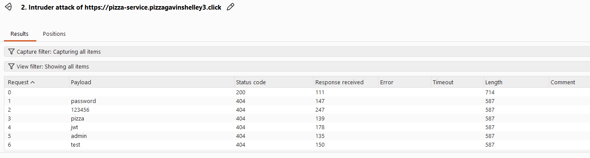
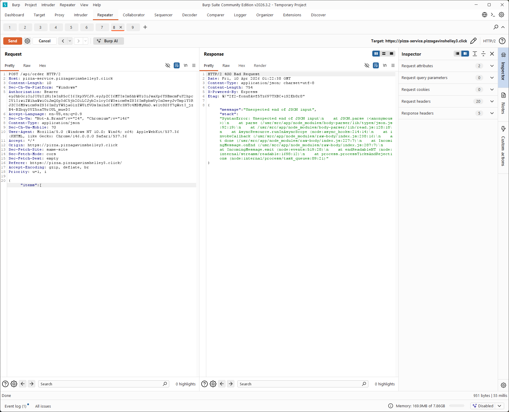

### Self Attack 1

- Date: April 9, 2026
- Target: https://pizza.pizzagavinshelley3.click
- Classification: Identification and Authentication Failures
- Severity: 2
- Description: I intercepted the login request in Burp Suite and changed the password to an empty string. The frontend blocks empty passwords, but the backend still accepted the request and returned a 200 OK with a valid JWT token. I was able to log in as `d@jwt.com` without entering a real password. So the backend wasn't actually validating the password and was just relying on the frontend to enforce it.
- Images: 
- Corrections: I added server side validation to reject missing, empty, and whitespace only passwords before authentication runs. After the fix, I resent the same Burp request and confirmed that the server no longer returned a valid token.

### Self Attack 2

- Date: April 9, 2026
- Target: https://pizza.pizzagavinshelley3.click
- Classification: Identification and Authentication Failures
- Severity: 1
- Description: I used Burp Suite Intruder to send multiple login attempts to `PUT /api/auth` with different password guesses. All of the incorrect attempts came back with consistent 404 responses, and I wasn't able to brute force a login. At the same time, I also did not see clear rate limiting, account lockout, or increasing delays. Since I was using Burp Community Edition, the requests were throttled, so I could not fully hammer the endpoint, but from what I saw, repeated login attempts were still allowed without obvious protections.
- Images: 
- Corrections: Add rate limiting and stronger handling for repeated failed login attempts. Also add logging and monitoring for suspicious login patterns.

### Self Attack 3

- Date: April 9, 2026
- Target: https://pizza.pizzagavinshelley3.click
- Classification: Broken Access Control
- Severity: 2
- Description: I intercepted a request to `GET /api/franchise/12` in Burp Suite and changed the ID in the URL. When I changed it to `GET /api/franchise/1`, the server still returned a 200 OK and gave me data for that franchise. I was also able to access franchise 12 while authenticated as a different user. This showed that the backend was not actually checking whether I was allowed to access the franchise ID I requested. I could get other franchise data just by changing the number in the URL.
- Images:  
- Corrections: I added authorization checks on the backend so users can only access franchise data they are actually allowed to view. The endpoint now validates ownership or permissions before returning data.

### Self Attack 4

- Date: April 9, 2026
- Target: https://pizza.pizzagavinshelley3.click
- Classification: Security Misconfiguration
- Severity: 1
- Description: I tested common endpoints using Burp Suite and manual navigation, including `/api/docs`, `/docs`, `/version.json`, and `/robots.txt`. These were all publicly accessible without authentication and exposed internal app structure and metadata. I did not use them to directly exploit the app, but they made it much easier to map out the site and see what routes and resources existed.
- Images: 
- Corrections: I restricted access to internal documentation and metadata endpoints by disabling them in production or requiring authentication. After the fix, those endpoints were no longer publicly accessible.

### Self Attack 5

- Date: April 9, 2026
- Target: https://pizza.pizzagavinshelley3.click
- Classification: Insecure Design
- Severity: 2
- Description: I intercepted a `POST /api/order` request in Burp Suite and changed the request body. When I sent malformed JSON, the server returned a 400 error but also exposed a full stack trace with internal file paths and library details. I was also able to change item prices in the request, including negative prices and really large values, and the server still accepted the order with those modified prices. This showed that the backend was trusting client supplied prices instead of enforcing the real menu prices on the server.
- Images:   
- Corrections: I added stronger server side validation for order requests and made sure pricing is enforced from the server side menu data instead of from the client request. I also replaced detailed error responses with generic ones so stack traces and internal implementation details are not exposed.
